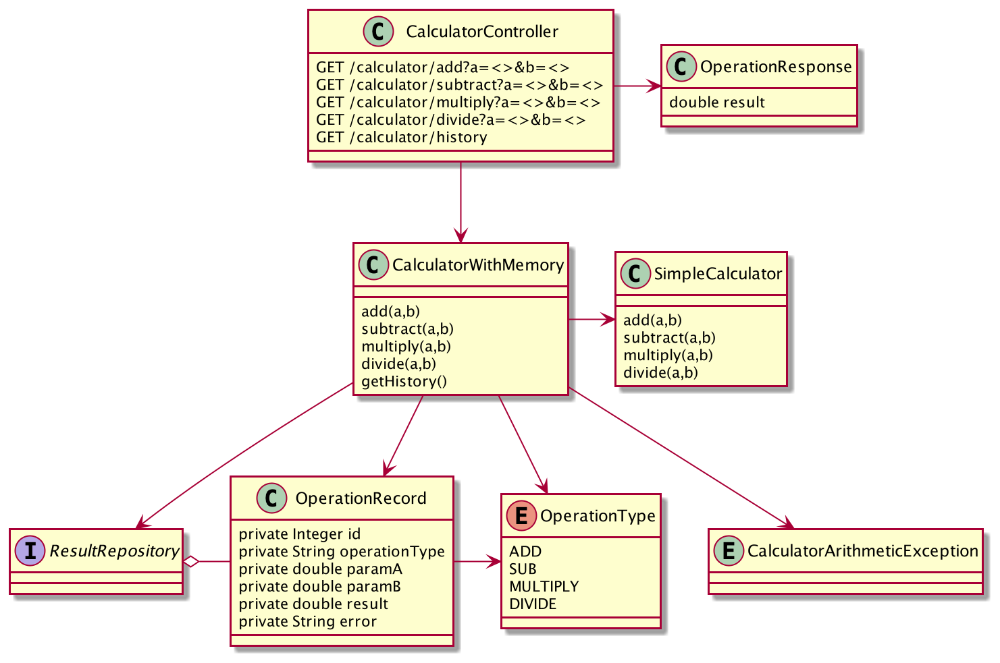

HCL Assignment
---

# Assignment description

## 1. Simple Calculator – Assessment

During this assessment you will create a Simple Calculator. The goal of this assessment is to judge your development capabilities. The evaluation of your assessment will be based on Agile Software Development Principles, Patterns and Practices and your knowledge on Java, Java frameworks and other development tools you use.

### 1.1. Description

The result of this assessment is to have a calculator backend that can perform calculations. It should have a web-based frontend. E.g. a form in which you can enter a calculation, submit it and display the result. Persist the result in a database. A history of all previous calculations should be shown as well.

Create a "SimpleCalculator"  Java class that will have the following operations:

- public double add(int, int)
- public double subtract(int, int)
- public double multiply(int, int)
- public double divide(int, int)

### 1.2. Guidelines

- Use Test Driven Development to build the "SimpleCalculator" RESTful API
- Use Spring (Boot) for the RESTful API
- Use the Maven build automation tool
- Use Java 11 and coding standards (only JavaDoc for most important parts)
- Use JUnit and Mocking where needed
- Use npm and Angular for the frontend.
- Use git for version control
- Use H2 for database
- Take your time into account. Use 2 dayparts for this assignment and use them to the fullest extent. Try to make the calculator as complete as possible demonstrating that you are familiar with the techniques above, but don’t overcomplicate.

### 1.3. Deliverable

The project(s) containing the code, build instructions and tests. Preferably posted in a repository in e.g. Github.

# Tasks

## Completed
- Use Test Driven Development to build the "SimpleCalculator" RESTful API - OK
- Use Spring (Boot) for the RESTful API - OK
- Use the Maven build automation tool - OK
- Use Java 11 and coding standards (only JavaDoc for most important parts) - OK
- Use JUnit and Mocking where needed - OK
- Use git for version control - OK
- Use H2 for database - OK

## Not completed
- Use npm and Angular for the frontend - Not completed

# Design

The SimpleCalculator is "simple", but it somehow constitutes the core algorithm of the system.
I decided to separate as much as possible the different functionalities, creating a layer of colasses:

- CalculatorController : the mapping between the APIs external definition and the internal implementation of the logic
- CalculatorWithMemory : built on top of the SimpleCalculator it adds the storage in the DB of the results
- SimpleCalculator : the core logical and "business logic" of the system

The CalculatorController is the component which will be invoked by the Angular user interface to perform the required operations.

I could have designed the API definitions and resources using an OpenAPI YAML file, 
and generate from that the needed resources classes, 
but for the size of this project it would have been an overkill, specially because the input and output resources structure (the requests and responses JSON) are extremely simple.

# Implementation

## REST APIs and Application BackEnd

### Create Spring Boot skeleton

    https://start.spring.io/#!type=maven-project&language=java&platformVersion=2.4.2.RELEASE&packaging=war&jvmVersion=11&groupId=it.brunasti.hcl&artifactId=calculator&name=Calculator&description=HCL%20Calculator%20Coding%20Assignment&packageName=it.brunasti.hcl.calculator&dependencies=devtools,lombok,configuration-processor,data-jpa,restdocs,web,h2

### Standard Spring MVC project directories structure

I create under it.brunasti.hcl.calculator a standard directories structure for the Spring MVN projects:

    - controller
    - exception
    - model
    - repository

I even create extra directories for the REST API resources (in our simple case only responses), and for the logic/algorithm classes

    - rest.responses
    - logic

I check that all is building correctly with the command:

    - mvn clean install

### Adding logging capability

By annotating the desired classes with

    @Slf4j

we can start logging what the app is doing

### Test coverage

The result of a full test coverage run provides a very good value:

- 100% of classes touched by tests
- 97% of the code lines covered

Most of the missing code lines / functions are the one created via Lombok, which should not be tested by definition.

### Error handling

A correct error handling requires the definition of specific set of exception conditions, with correct error codes returned to the clients.

For example in case the user requires a division by 0, a CalculatorArithmeticException is internally rised and a 400 error code is returned to the user.

### Check the DB content

To check what have been stored in the DB I create an extra endpoint which returns all the records found in the DB

Calling the URL

    http://localhost:8080/calculator/history

you can see all the operation that have been executed on the server.

Here is an example of the output:

    [ 
        {
            "id": 1,
            "operationType": "multiply",
            "paramA": 4.0,
            "paramB": 3.0,
            "result": 12.0
        },
        {
            "id": 2,
            "operationType": "divide",
            "paramA": 1.0,
            "paramB": 0.0,
            "result": 0.0,
            "error": "/ by zero"
        }
    ]

## Angular FrontEnd application

- not fully implemented